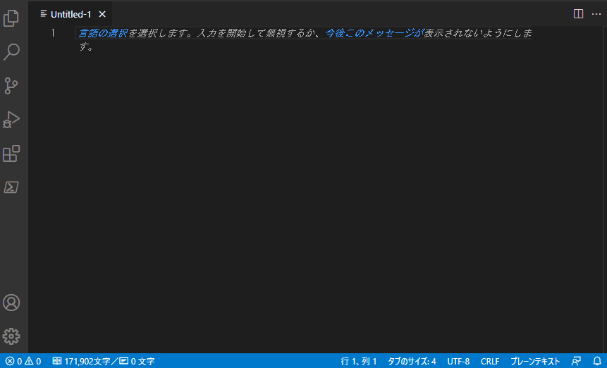
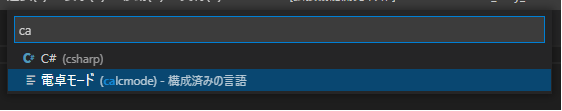
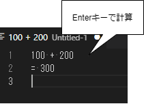
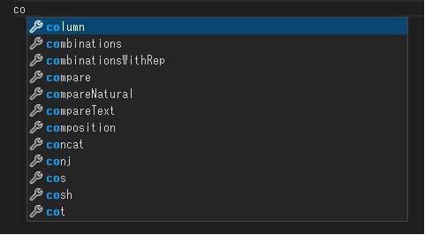
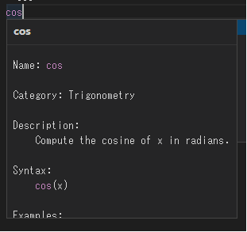

# 電卓拡張機能

[MathJS](https://mathjs.org)を使用した電卓拡張機能です。

詳細：
 使用できる機能は、「MathJS」のページを参照ください。
[https://mathjs.org/docs/expressions/syntax.html](https://mathjs.org/docs/expressions/syntax.html)
[https://mathjs.org/docs/reference/functions.html](https://mathjs.org/docs/reference/functions.html)

## 使い方

### 1. 言語モードの選択

### 2. 計算式の入力

式を入力して、Enterキーで計算結果が表示されます。

#### 関数名をサジェスト

#### ホバーで関数のヘルプを表示

## リリースノート

### 0.0.2

* 数値の表記関連の修正
 1. デフォルトをBigNumberに変更
 1. 数値表記 指数表記に変える桁数の上限を15桁に変更

